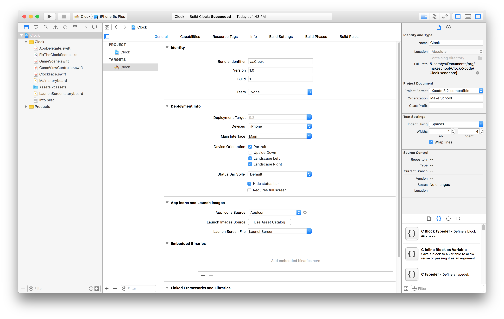
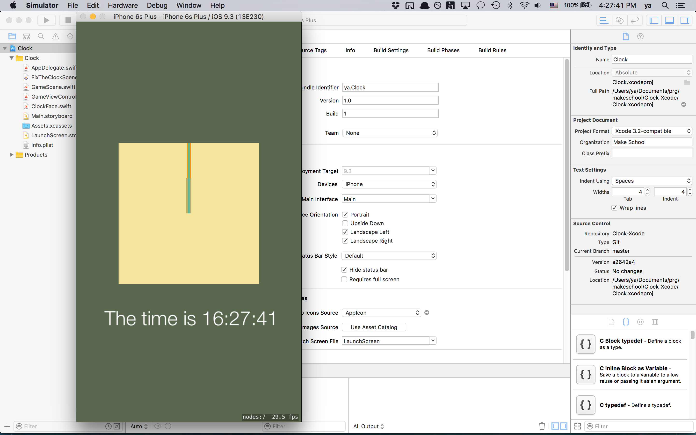

Great! So far, your screen should look something like this:

Let's dissect the different user interface elements we're seeing here:

- On the left hand side, there is your __Navigator__: This lists all the files that are in the project hierarchy. You can _single-click_ on any one of the files there, to change the center pane to display the file you want to look at. Note that _double-clicking_ will open up a new window containing the file instead, so make sure you always single-click to navigate to files. Try navigating to the file `ClockFace.swift` now.
  - There are multiple tabs available within the Navigator section, which you can reveal by clicking on the icons on the top, or by using the keyboard shortcuts ⌘1, ⌘2, etc. Particularly useful tabs include the __Find__ tab (⌘3) – which lets you do a full text search on your entire project – and the __Issues__ tab (⌘4), which lets you know of any compile-time or run-time errors and warnings you may have.
  - At the bottom left corner of the navigator, there's a "+" sign. If you click it, you can create new files in your project hierarchy (You can also use the handy shortcut ⌘N). Note that the file will be placed under the current group that your navigator has selected: therefore, make sure you click a group you want your new file to be under, before you add.
- On the right hand side is your __Utilities__ sidebar: This will show you quick information about the file you have opened currently; in the case of a `.swift` file, it will tell you information like the file path that it resides in, its group path, and various text settings like the text encoding and tab setting.
- The center pane you've been staring at is the __Editor__ – where you edit your code! Besides obviously being able to make changes to your code, you can navigate to different files via the breadcrumb menu at the top of the pane.
- There is a __Debug Area__ pane at the bottom side of your window; this would display your `print()` statements if you decided to run any from your code. If you don't see it, click the middle button in the 3-button group at the top right corner of your window, or press the shortcut ⇧⌘Y. The debug area is very useful for testing your program output!
- Lastly, at the top left corner of the window – right next to the window close/minimize/maximize buttons – are your __Play__, __Stop__, and __Device Selection__ buttons! Hitting Play will compile and run your code, and hitting Stop will stop execution of your code. Clicking on the Devices menu will allow you to select the __iOS Simulator__ that you'd like to use to run the project, or a physical iOS device that you have connected to the computer. If you don't have any simulators installed, you can install them from the "Add Additional Simulators..." option from the menu.

Now that we have a grasp of the Xcode interface, let's try running the starter code to see what we're looking at!

> [action]
> Run the starter code: First, select "iPhone 6s" from the list of simulators. Then, press the Play button!
> A new application entitled "iOS Simulator" should open up. After a few moments for it to boot up, it should load up the app, displaying a clock on the screen!
> 

<!--  -->

> [info]
> If the simulator window is too large or zoomed in for your computer screen, you can change the zoom level of the Simulator via the hotkeys ⌘1, ⌘2, and ⌘3.

Great! The text in the app tells you the correct time...but the analog clock is stuck at midnight (or 12:00 noon)! In the next section, you'll write code to fix this, and get our clock working!
