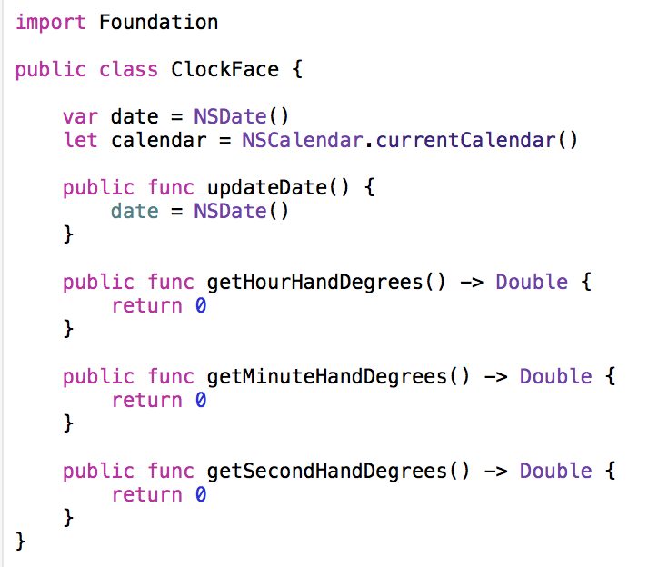

Where we left off, we were looking at a halfway-functional clock app: The text read the correct time, but analog clock was stuck at 12:00. In this section, we'll fix that!

## Code Organization

In order to figure out what's wrong with the code, let's do a quick tour of some of the classes involved. You can follow along by selecting each `.swift` file and glancing at its contents.

- __GameViewController.swift__: This loads up a SpriteKit Scene called "FixTheClockScene", and presents its view as the main view on display. We won't go into much detail here, but you can read about the Model-View-Controller programming pattern at Apple's website, [here](https://developer.apple.com/library/mac/documentation/General/Conceptual/DevPedia-CocoaCore/MVC.html).
- __GameScene.swift__: This loads up all of the graphical elements of our Clock scene, using the accompanying SpriteKit file, `FixTheClockScene.sks`. It contains update code that fires a clock update function, but it retrieves the value of how much to rotate each of the hands from another class...
- __ClockFace.swift__: This class has some basic utility code that when given a `NSDate` (Apple's way of storing information both date _and_ time), and a `NSCalendar` (A class that handles the calendar system in which you _interpret_ the current date and time), it will return `Double`s that represent each of the clock hand rotations, in degrees.

Can you see which one of these files are incomplete?



That's right: currently, all the functions in `ClockFace.swift` are returning 0! That can't be right. Let's implement these functions, one at a time.

# NSDate, NSCalendar, and Components

In order to retrieve the hour, minute, and second values of the current time, it's necessary to understand the classes that we would have to make calls to. The way Apple's API handles date and time is quite elegant: Due to timezones, alternate (Non-Gregorian) calendars, etc., the concept of a "moment in time" and the "interpretation" of said time, are separated out in its own categories. The `NSDate` class handles retrieval of a "moment in time", and `NSCalendar` handles the "interpretation" part.

If you want more information on these classes, Matt Thompson has an excellent post detailing NSDateComponents [here](http://nshipster.com/nsdatecomponents/).

So what does this mean in code? Read on:

In order to get the current time (in as accurate as milliseconds), you instantiate a new `NSDate` object, like so:

```swift
let date = NSDate()
```

This date object represents a snapshot in time: it contains information about the precise moment in time when you called that initializer. In order to get any useful information about that moment in time, though, you need a calendar:

```swift
let calendar = NSCalendar.currentCalendar()
```

This code looks at your iPhone's time settings, keeping in mind location, locale, 24-hour vs. 12-hour display preferences, and other settings, getting you a specific display of how _you_ perceive time in your culture.

In our world, we want the second, minute, and hour (in 12-hour mode) of the time in our local time zone, so we simply retrieve the information:

```swift
let hour: Int = calendar.component(.Hour, fromDate: date) % 12 // just in case it returns 24-hour time
let minute: Int = calendar.component(.Minute, fromDate: date)
let second: Int = calendar.component(.Second, fromDate: date)
```

Note that we use the `%`, or _modulo_ operator, to force the hour value to be between the range of 0 and 12.

Now that we know how to retrieve the current time, let's get calculating the degree rotation on each of the hands!

# Degrees Rotation, and Math

Remember, degrees in a circle go from 0 to 360. In our specific setup, 0 degrees refers to the clock hand in its 12 o'clock position; as the degrees increase, it rotates _clockwise_, until it reaches 12 o'clock at 360 degrees again.

If you work out the math in your head, that means that when each second passes, the second hand on a clock moves an amount of 360 degrees divided by 60 seconds, or 6 degrees per second. That means that if you know the second value on your digital clock, you can just multiply that number by 6 to get the rotation in degrees!

Knowing this, let's write the `getSecondHandDegrees()` function. This function gets called every second, just like all the other functions in this class. You can make use of the `date` and `calendar` variables, which are set up to be at the current time at the time of the function call.

> [action]
> Complete the `getSecondHandDegrees()` function, using the above code as hints. Remember, your function should return a `Double` value, representing the rotation in degrees that the second hand should have. Since `calendar.component(.Second, fromDate: date)` returns an `Int` value, you'll have to cast it to a `Double`!

<!--  -->

> [solution]
> You should have something like this:
>
```swift
public func getSecondHandDegrees() -> Double {
    let second = calendar.component(.Second, fromDate: date)
    return Double(second) * (360.0 / 60)
}
```

Got it? Now, let's do the same for the minute and hour hands, using the same concept. Once you're done, run your code and see how it compares to an actual analog clock. Is your math correct?

> [action]
> Complete the two remaining functions – `getHourHandDegrees()` and `getMinuteHandDegrees()`. Do the same thing that you did with seconds, except use the `.Minute` component now!

<!--  -->

> [solution]
> Compare your code with the solution here. If yours looks a little more complicated than the code shown here, hang tight and don't change your code – you might be ahead of the game!
>
```swift
public func getHourHandDegrees() -> Double {
    let hour = calendar.component(.Hour, fromDate: date) % 12 // just in case it returns 24-hour time
    return Double(hour) * (360.0 / 12)
}
>
public func getMinuteHandDegrees() -> Double {
    let minute = calendar.component(.Minute, fromDate: date)
    return Double(minute) * (360.0 / 60)
}
```

# That doesn't quite look right...

You might've noticed that if you look at an analog clock pointing at 6:30 for instance, the hour hand doesn't point exactly at 6. Because it's _halfway_ to 7 o'clock, the hour hand is similarly _halfway_ between 6 and 7. Our current code doesn't actually do this. Let's change that.

Let's start with the hour hand first. Because there are 12 hours in a 360 degree hour hand rotation, for each hour the hour hand moves (360 / 12) = 30 degrees. But, for each minute within those hours, the hour hand moves a 60th of that space between each hour. That means that for each minute, the hour hand moves (360.0 / 12 / 60) = 0.5 degrees. Let's write that in code.

```swift
public func getHourHandDegrees() -> Double {
    let hour = calendar.component(.Hour, fromDate: date) % 12 // just in case it returns 24-hour time
    let minute = calendar.component(.Minute, fromDate: date)
    return Double(hour) * (360.0 / 12) +
           Double(minute) * (360.0 / 12 / 60)
}
```

But wait! What about the seconds? Doesn't the hour hand move a miniscule amount for each second, too?

You're right. Can you figure out the complete equation for the hour hand degree movement?

> [action]
> Complete the `getHourHandDegrees()` function, using all of the hour, minute, and second values into account when calculating the rotation in degrees.

<!--  -->

> [solution]
> Your code should look like this:
>
```swift
public func getHourHandDegrees() -> Double {
    let hour = calendar.component(.Hour, fromDate: date) % 12 // just in case it returns 24-hour time
    let minute = calendar.component(.Minute, fromDate: date)
    let second = calendar.component(.Second, fromDate: date)
    return Double(hour) * (360.0 / 12) +
           Double(minute) * (360.0 / 12 / 60) +
           Double(second) * (360.0 / 12 / 60 / 60)
}
```

<!--  -->

> [action]
> Good job. Now can you do the same for the minute hand?

<!--  -->

> [solution]
> Your code should look like this:
>
```swift
public func getMinuteHandDegrees() -> Double {
    let minute = calendar.component(.Minute, fromDate: date)
    let second = calendar.component(.Second, fromDate: date)
    return Double(minute) * (360.0 / 60) +
           Double(second) * (360.0 / 60 / 60)
}
```

Run your code now. Congratulations – that looks just like a true analog clock!

In the next section, you'll learn how to run this project on a physical iPhone! If you don't have an iOS device on you, you can skip this next section.
